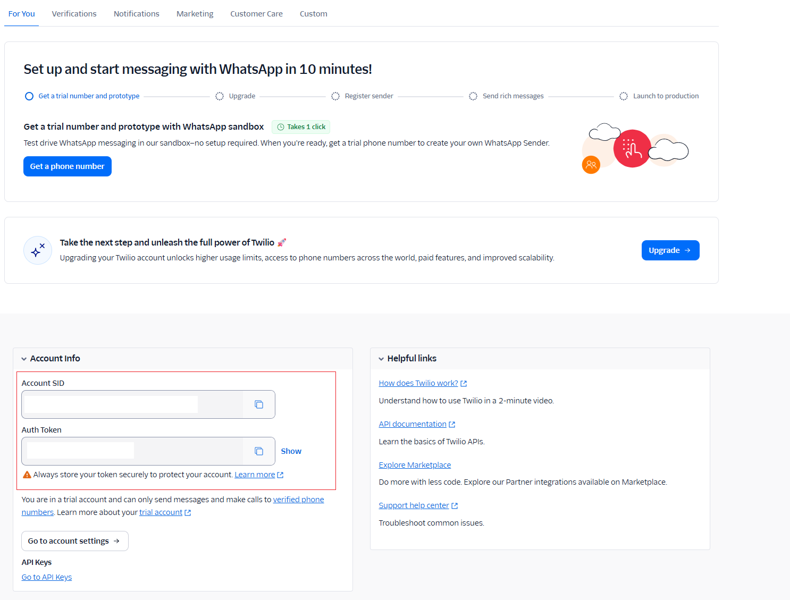
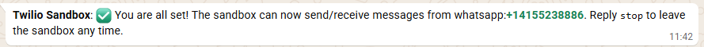
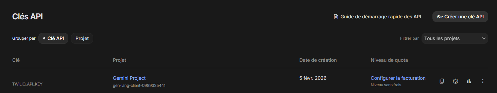
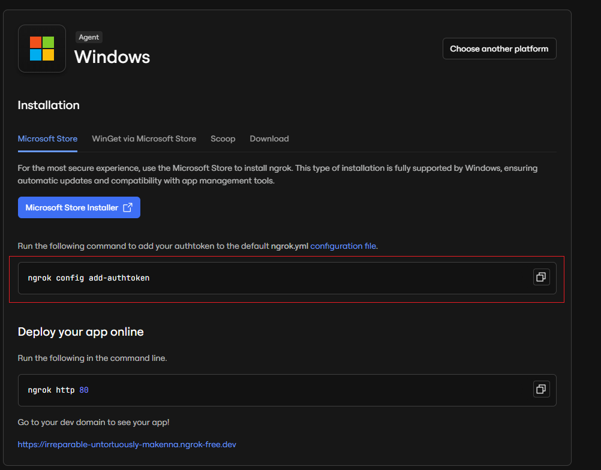

# Agent de Relance Client via WhatsApp

Ce projet est un agent automatisé conçu pour effectuer des relances clients via WhatsApp. Il est construit avec NestJS, utilise MongoDB pour la persistance des données et s'intègre à l'API Twilio pour l'envoi de messages.

## Architecture du Projet

Le projet est structuré autour d'une architecture modulaire utilisant **NestJS** pour le backend. Voici les composants clés :

-   **Backend (NestJS)** : Gère la logique métier, les interactions avec la base de données et les APIs externes.
-   **Base de Données (MongoDB)** : Stocke les informations des contacts et l'historique des messages.
-   **IA (Google Gemini)** : Génère le contenu des messages de relance et planifie les actions en fonction du contexte.
-   **Messagerie (Twilio)** : Assure l'envoi et la réception des messages WhatsApp.
-   **Infrastructure (Docker)** : Conteneurisation de l'application, de la base de données et du tunnel Ngrok pour un déploiement simplifié.

## Structure du Projet

Le projet est organisé en deux dossiers principaux à la racine :

```
.
├── back-end/      # Application NestJS (API, Agent, MongoDB)
│   ├── src/
│   │   ├── contact/      # Gestion des contacts (Schémas, Services)
│   │   └── twillio_app/  # Logique de relance (Twilio + Gemini)
│   └── Dockerfile
└── frontend/     # Interface Utilisateur (React - Optionnel)
```

## Prérequis

- Docker & Docker Compose
- Node.js & npm (pour exécuter les scripts manuels)

## Configuration

1.  **Créer le fichier d'environnement**

    Copiez le contenu de `.env.example` dans un nouveau fichier nommé `.env` à la racine du projet.

    ```bash
    cp .env.example .env
    ```

2.  **Remplir le fichier `.env`**

    Ouvrez le fichier `.env` et remplacez les valeurs d'exemple par vos propres clés et informations. Vous devrez notamment fournir :
    - Vos identifiants Twilio (`TWILIO_ACCOUNT_SID`, `TWILIO_AUTH_TOKEN`).
    - Votre numéro WhatsApp Sandbox de Twilio (`TWILIO_WHATSAPP_NUMBER`).
    - Votre clé API Gemini (`GEMINI_API_KEY`).
    - Votre token d'authentification ngrok (`NGROK_AUTHTOKEN`).
    - Le numéro de téléphone cible pour les tests (`TARGET_PHONE_NUMBER`).

3.  **Procédure de création des identifiants, clés et tokens**

    - Pour récupérer les identifiants Twilio, se rendre sur `console.twilio.com` et cliquer sur `Account Dashboard`, le compte SID et le token se trouvent ici :
    

    - Pour récupérer le numéro Whatsapp, il peut être trouvé dans `Messaging / Try it out / Send a Whatsapp message` mais sera généralement défini en `whatsapp:+14155238886`. Pour votre numéro de téléphone, il faudra reprendre la même structure d'écriture à savoir : `whatsapp:+VOTRE_NUMERO_DE_TELEPHONE`. 
    Pour pouvoir lancer l'application Twilio sur Whatsapp, il suffit de taper :
    ```bash
        join huge-picture
    ```
    Si ce message est écrit : 
    
    Votre téléphone est lié à la Sandbox. (Pour se déconnecter, il suffit d'écrire `stop`.)

    - Pour récupérer la clé API Gemini, elle se trouve sur le site `aistudio.google.com`. Se rendre sur `Get API key` puis `Créer une clé API`, elle sera ensuite générée et vous pourrez la copier-coller dans le fichier `.env`.
    

    - Pour récupérer le token d'authentification ngrok, il est disponible sur la page d'accueil du site ``dashboard.ngrok.com/get-started/setup/windows` et de faire la commande : 
    ```bash
        ngrok config add-authtoken VOTRE_TOKEN
    ```
    

4.  **Configuration du Webhook Twilio**
Une fois les services lancés :
    - Aller sur [http://localhost:4040](http://localhost:4040) pour copier l'URL publique générée par ngrok (ex: `https://a1b2-c3d4.ngrok-free.app`).
    - Rendez-vous dans la console Twilio : **Messaging > Settings > WhatsApp Sandbox Settings**.
    - Coller l'URL dans le champ **"When a message comes in"** en ajoutant le endpoint de votre API (ex: `https://your-url.ngrok-free.app/whatsapp/webhook`).
    
    

## Utilisation

### Lancement des services

Pour démarrer l'ensemble des services (backend, base de données, ngrok), exécutez la commande suivante à la racine du projet :

```bash
docker-compose -f compose.dev.yaml up --build
```

- Le backend sera accessible sur le port défini par `BACKEND_PORT`.
- L'interface web de ngrok sera disponible sur `http://localhost:4040` pour inspecter le trafic et récupérer l'URL publique de votre backend. Cette URL doit être configurée dans la Sandbox WhatsApp de Twilio.

### Arrêt des services

Pour arrêter et supprimer les conteneurs, utilisez :

```bash
docker-compose -f compose.dev.yaml down
```